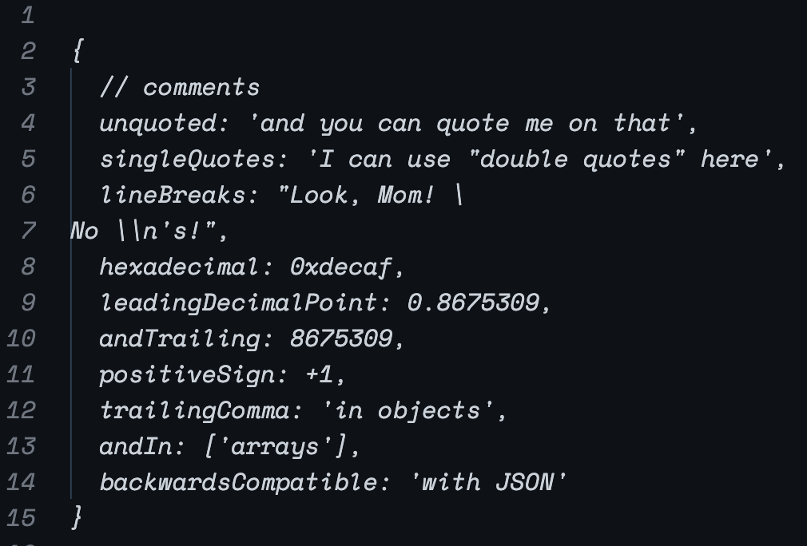
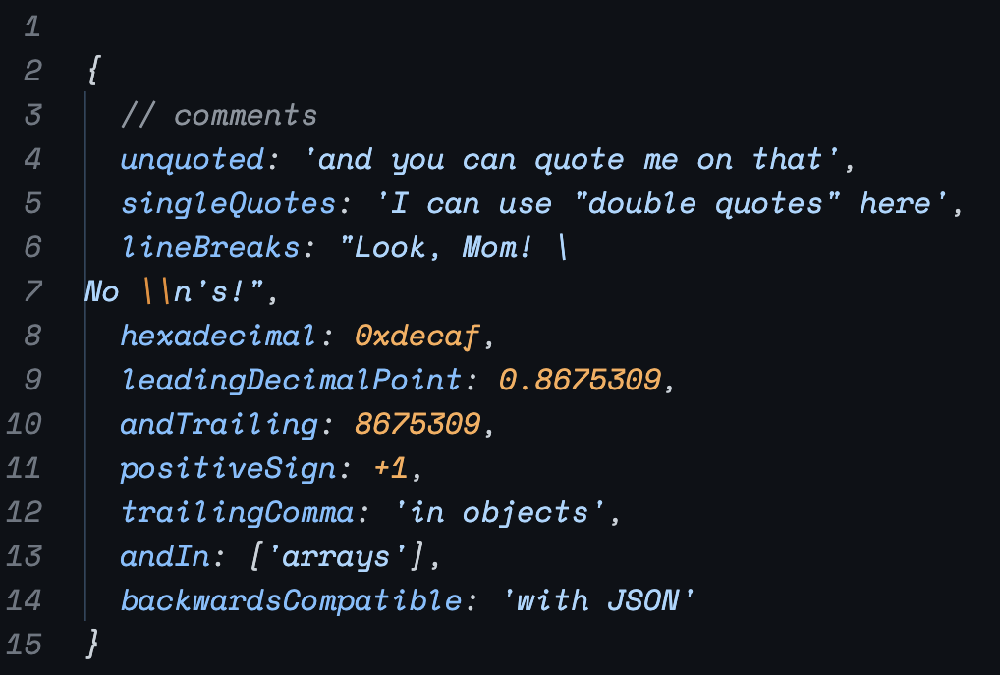

# json5-for-vscode README

Elevate your coding experience with the JSON5 Formatter & Highlighter - the ultimate tool for developers working with JSON5 data!

## Key Features:

### Advanced JSON5 Formatting

Automatically format and beautify your JSON5 files with a single click. Our plugin intelligently handles various JSON5 structures, ensuring your data is organized in a readable and consistent manner.

### Syntax Highlighting

Enjoy crystal-clear visibility with our syntax highlighting feature. It differentiates elements like keys, values, strings, and numbers, making your JSON5 data easy to navigate and understand.

before:

after:

## Known Issues

- [ ] No error checking for now.
- [ ] Some highlighting may be wrong, please let me know if you find any.
- [ ] More custom configurations need to be released.

## Release Notes

### 0.0.1

Initial release of json5-for-vscode.

### 0.0.2

Update icon and package.

---

## For more information

* [What's JSON5](https://json5.org)

**Enjoy!**
